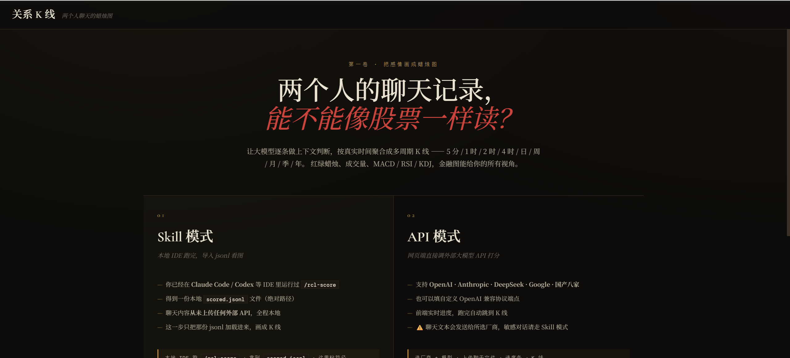
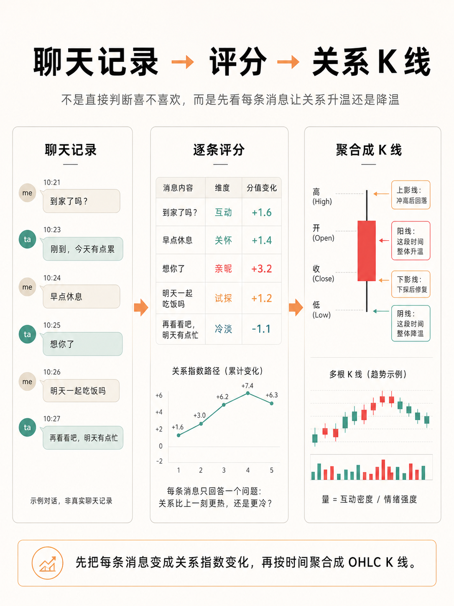
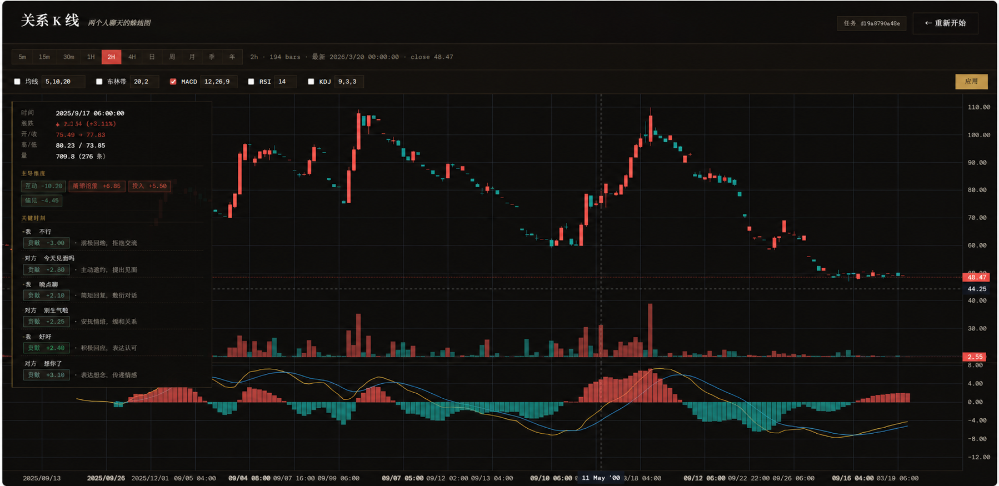
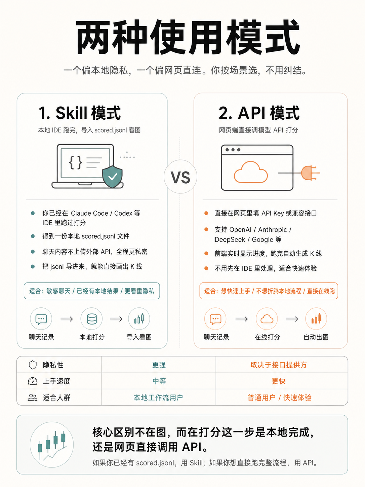

<p align="center">
  
</p>

<h1 align="center">聊天关系K线 · Relationship Candlestick Lab</h1>

<p align="center"><i>把聊天记录画成K线图，看你和TA的关系曲线</i></p>

> 把两个人的聊天记录，压缩成一张 K 线走势图。

**像读股票 K 线一样，读一段关系的变化。**

系统先对聊天记录里的**每一条消息**进行量化：
一条冷淡回复会让关系价格下跌，一句暧昧称呼会让价格上涨，一次吵架会形成下探，一次解释和修复会把价格重新拉回。

当每条消息都被转化成带时间戳的关系指数后，系统再把这些指数按 5 分钟、1 小时、日线、周线等周期压缩成 K 线蜡烛图：

- **Open**：这个周期开始时的关系指数
- **High**：这个周期内关系最热的时刻
- **Low**：这个周期内关系最冷的时刻
- **Close**：这个周期结束时的关系指数
- **Volume**：这段时间的互动密度和情绪强度

所以，一根关系 K 线不是模型主观生成的，而是由消息级指数路径自然聚合出来的。
上影线代表关系曾经冲高但回落，下影线代表关系曾经下探但被修复。

<p align="center">
  
</p>

<p align="center"><i>↑ 不是直接判断"喜不喜欢"，而是先看每条消息让关系升温还是降温，再按时间聚合成 OHLC K 线</i></p>

---

## 它能给你什么

- **K 线 + 成交量**：每根 bar 看那段时间的关系强度变化、互动密度
- **MA / 布林带 / MACD / RSI / KDJ**：你熟悉的技术指标，本地计算，零等待
- **每根 K 线的事件归因**：鼠标悬停 → 「这天主要是 *亲昵 +1.4 / 互动 -1.15* 在拉动」+ 4 条最有代表性的关键消息
- **多个时间周期**：5m / 15m / 30m / 1h / 2h / 4h / 日 / 周 / 月 / 季 / 年
- **历史分析记录**：每次跑过的任务都留在本机，随时回看

<p align="center">
  
</p>

<p align="center"><i>↑ 实际效果：悬停某根 K 线时，左侧自动展开归因——主导维度（互动 -10.20 / 投入 +5.50）+ 那段时间的关键消息</i></p>

---

## 准备工作：先导出你的微信聊天记录

整个工具的输入是**两个人的聊天导出文件**——所以第一步是用一个微信数据导出工具，把你和某个人的对话导成 CSV（推荐）/ JSON / TXT。

推荐两个开源导出工具（任选其一）：

| 工具 | Stars | 技术栈 | 描述 |
|---|---|---|---|
| [**WeFlow**](https://github.com/hicccc77/WeFlow) | 9.1k | TypeScript / Electron | 本地微信聊天记录导出 + 年度报告应用，桌面 GUI |
| [**WeChatDataAnalysis**](https://github.com/LifeArchiveProject/WeChatDataAnalysis) | 1.1k | Python | 微信 4.x 数据解密、高仿微信界面，支持导出聊天记录、朋友圈、年度总结等 |

> 其他可用工具：pywxdump、Memotrace 等。**任何能产出"两个人对话表"的工具都行**——只要列里有发送者、时间戳、消息内容三样。

导出完拿到一个聊天文件就行，后面的所有步骤都基于这个文件。

**不是微信也能用**：本工具只看"两个发送者轮流发消息"的结构，所以 iMessage / Telegram / Discord DM / Instagram DM 等只要能导出成相同格式，一样能跑（详见下面 [输入格式](#输入格式)）。

---

## 一键启动

> 前提：你电脑上有 **Python 3.9+**。
> 没有的话去 [python.org/downloads](https://www.python.org/downloads/) 装一个。
> Windows 安装时记得勾上 *Add Python to PATH*。

下载本仓库后，**在仓库目录下打开终端**（Windows: PowerShell / cmd；macOS: Terminal），跑：

```bash
python start.py
```

`start.py` 会自动：检查依赖 → 缺什么就提示装什么 → 启动本地后端 → 帮你打开浏览器到 `http://127.0.0.1:7000`。

> macOS / Linux 上如果默认是 Python 2，请用 `python3 start.py`。

打开网页后，会让你二选一：

| | 适合谁 |
|---|---|
| **本地分析（Skills 模式）** | 你已经在用 Claude Code / Codex 等 IDE，希望聊天数据完全不出本机 |
| **在线分析（API 模式）**   | 想直接图形化操作，愿意把聊天发给所选模型厂商 |

---

### 如果你想手动控制每一步

也行，传统三步：

```bash
git clone https://github.com/ZhenyuanPAN822/relationship-candlestick-lab.git
cd relationship-candlestick-lab
pip install -r requirements.txt

# 选装一个 LLM SDK（按你要走的厂商）
pip install anthropic              # 走 Claude
pip install "openai>=1.30"          # 走 GPT / DeepSeek / Gemini / 国产八家

# 启动
python -m relationship_candlestick.cli serve
# → 浏览器打开 http://127.0.0.1:7000
```

---

## 两条工作流

<p align="center">
  
</p>

<p align="center"><i>↑ 一个偏本地隐私，一个偏网页直连——按场景选，不用纠结</i></p>

### 路线一 · 本地分析（Skills 模式）

聊天记录全程不出本机。**适合敏感对话**。

1. 在你常用的 IDE（Claude Code / Codex / GPT 桌面端…）里把本仓库的 `skill/SKILL.md` 注册为 Skill
2. 在 IDE 中输入 `/rcl-score`
3. Skill 会引导你粘聊天文件路径，然后自动跑：拆单字 → 聚合连发 → 逐条评分 → 反扩展回消息级
4. 跑完会给你一份本机评分文件的路径
5. **在仓库目录下跑 `python start.py` 启动网页**
6. 浏览器自动打开后选「导入本地文件」，把刚才的路径粘进去

> 推荐：Claude Sonnet 4.6 + effort `low`，或 GPT-5 系列 + effort `low`。
> 1000 条消息约 7 分钟。

### 路线二 · 在线分析（API 模式）

让网页端直接调外部模型 API 跑。

1. **在仓库目录下跑 `python start.py` 启动网页**
2. 浏览器自动打开 `http://127.0.0.1:7000`，选「在线分析」
3. 选厂商 + 模型，填 API Key，给聊天文件路径
4. 进度跑完自动跳到 K 线页

支持的厂商（每家都内置最新主流型号，也能自定义模型 ID）：

| 厂商 | 协议 |
|---|---|
| Anthropic（Claude） | Anthropic SDK |
| OpenAI（GPT） · DeepSeek · Google Gemini · xAI（Grok） · Moonshot（Kimi） · 通义千问 · 智谱 GLM · 字节豆包 · 百度文心 ERNIE · 任意 OpenAI 兼容端点 | OpenAI 兼容 |

---

## 输入格式

支持 **CSV / JSON / TXT**：

- **CSV**（推荐）：微信导出 CSV、pywxdump、Memotrace 等都能识别
- **JSON**：数组，每条 `{timestamp, sender, message}`
- **TXT**：每行 `YYYY-MM-DD HH:MM[:SS] sender: message`

`examples/` 下有三种格式的合成示例可参考。

---

## 项目结构

```
relationship-candlestick-lab/
├── relationship_candlestick/   ← Python 后端模块
│   ├── pipeline.py             核心：预处理 + 评分 + 反扩展
│   ├── server.py               FastAPI Web 后端
│   ├── ohlc.py                 K 线聚合 + 每根 bar 的归因
│   ├── indicators.py           MA / 布林带 / MACD / RSI / KDJ（纯本地）
│   ├── parser.py               CSV / JSON / TXT 解析
│   └── cli.py                  命令行入口
├── frontend/                   ← 前端单页应用
├── scripts/                    ← 流水线 CLI 脚本
├── skill/SKILL.md              ← Claude Code Skill 入口 + v3.1 评分规则
├── config/default_weights.yaml ← 数值参数
├── examples/                   ← 合成示例数据
├── tests/                      ← 39 个 pytest 单元测试
├── ARCHITECTURE.md             ← 架构 + 多厂商 API 接入清单
└── README.md
```

---

## 评分规则（v3.1）

### 核心思想：相对评分，不是绝对评分

LLM **不**打"这条消息亲昵度 = 5"这种绝对分（因为没有客观锚点）。
它给每条消息**两个相对 delta**：

- `delta_vs_prior` — 比**紧挨着的上一条**消息暖了 / 冷了多少
- `delta_vs_atmosphere` — 比**最近 20 条的整体氛围**暖了 / 冷了多少

为什么这么设计？"这条比上一条暖一点"、"这条比这两天的氛围突然冷下来"是人类能稳定判断的；"这条值多少分"则不是。

### 10 个语义维度

除了两个 delta，每条消息还要标一个**主导维度**——是哪个轴在拉动这条消息：

| 维度 | 含义 | 推涨示例 | 推跌示例 |
|---|---|---|---|
| **affection** | 情感温度 | 宝宝 / 想你 / 晚安宝贝 | 单字"哦/嗯" / 呵呵 / 无所谓 |
| **engagement** | 互动投入 | 长回复 / 主动延展 / 秒回 | 敷衍短回 / 转移话题 / 拖延 |
| **care** | 关心 | 关心身体 / 记得对方细节 | 漠视处境 / 嘲讽状态 |
| **conflict** | 冲突（双向）| 道歉 / 示弱 / 让步（修复）| 阴阳 / 翻旧账 / 冷战（攻击）|
| **tension** | 暧昧张力 | 试探 / 吃醋 / 打闹 | 明确划界 / 拒推进 |
| **investment** | 关系投入 | 主动约 / 锁时间地点 / 送礼 | 拒邀约 / 取消计划 / 找借口 |
| **awkwardness** | 默契度（反向）| 接梗 / 共笑 / 流畅来回 | 尬聊 / 答非所问 / 突兀转场 |
| **future_orientation** | 未来导向 | "等寒假回来" / "以后" | "先到这吧" / 拒谈未来 |
| **vulnerability** | 暴露脆弱 | 分享秘密 / 感情史 / 弱点 | 回避深入 / 筑墙 |
| **shared_identity** | 内圈语言 | 用昵称 / 用内梗 / "我们" | 刻意外圈称呼 |

> 注意：维度只用于**展示和归因**（鼠标悬停一根 K 线时显示"这天主要是 *亲昵 +1.4* 在拉动"），**不进入数学计算**。真正驱动 K 线的是两个 delta。

### 评分尺度（每条消息都在动指针）

真实聊天里**没有两条连续消息温度完全一样**。哪怕话题情绪看起来一样，也有微动：emoji-only 比文字轻一点、"嗯"在干货之后是小冷却、"哈哈"在对方笑话之后是小确认。所以默认 delta 是 **±0.2 ~ ±0.5 的小非零**，不是 0。

| Delta 量级 | 含义 | 真实聊天里的频率 |
|---|---|---|
| **±0.2 ~ ±0.5** | 微波动——自然起伏 | **大多数消息都在这** |
| ±0.5 ~ ±1.5 | 轻微但能感知的变化 | ~25% |
| ±2 ~ ±4 | 明显能注意到的变化 | ~10% |
| ±5 ~ ±8 | 大动作（试探 / 邀约 / 修复 / 冲突）| ~3% |
| ±9 ~ ±15 | 罕见标志事件（告白 / 分手）| < 1% |
| `0, 0` | 真的完全不动——少用 | < 15% |

正是这些微波动让 K 线长出**影线**：上影 = 那段曾经冲高但回落，下影 = 那段曾经下探但被修复。
如果 LLM 全部输出 `0, 0`，K 线就是一条平直线，所有故事都没了。

### 框架做的事：时间衰减 + OHLC 聚合

每条消息打完分后，本地 Python 框架按下面的公式递推关系指数：

```
gap_hours   = 距上条消息的真实时长
decay       = 1 - exp(-gap_hours / 72)              # 72 小时半衰期
delta_blend = 0.5 × delta_vs_prior + 0.5 × delta_vs_atmosphere

index_t = prev_index × (1 - decay) + 50 × decay + delta_blend
```

含义：

- **混合两个参考帧**：`vs_prior` 和 `vs_atmosphere` 各占一半，避免单一视角偏差
- **时间衰减**：长时间不聊，关系指数自动往 50 基线回归——LLM 不用手动惩罚"长时间没说话"
- **不夹紧**：指数可以突破 100，也可以跌破 0（罕见，但允许）

之后按你选的周期（5m / 1h / 日 / 周 / 月 …）把消息级指数压成 OHLC：

| | 含义 |
|---|---|
| **Open** | 周期开始时的关系指数 |
| **High** | 周期内的最高点 |
| **Low** | 周期内的最低点 |
| **Close** | 周期结束时的关系指数 |
| **Volume** | 那段时间的互动密度 × 情绪强度 |

完整规则、Worked examples（密集 flirt 段、冷战段、单条事件三类示例打分）、边界情况见 [`skill/SKILL.md`](skill/SKILL.md)。架构和评分流水线见 [`ARCHITECTURE.md`](ARCHITECTURE.md)。

---

## 隐私

- **本地分析**：聊天数据全程不出本机
- **在线分析**：聊天文本会发送给你选的厂商。敏感对话请走本地分析
- API Key 只在浏览器本会话使用，**不写入** localStorage
- 文件路径**不写入** localStorage（早期版本会写，从 v6 起严格不写）
- `.gitignore` 默认排除 `output/`，分析结果不会被误推到仓库
- 本仓库不收集任何遥测，不上报使用数据

---

## 它**不**能干的事

- 不预测对方真实想法、不预测关系结果
- 不做"TA 喜不喜欢你"这种主观判断
- 它只读你能在聊天里看见的信号，给一个走势图

如果你想用它来做决定，请先意识到这只是一种**事后视角的可视化**。

---

## License

MIT — 详见 [`LICENSE`](LICENSE)。
图表库 lightweight-charts 是 Apache 2.0。
